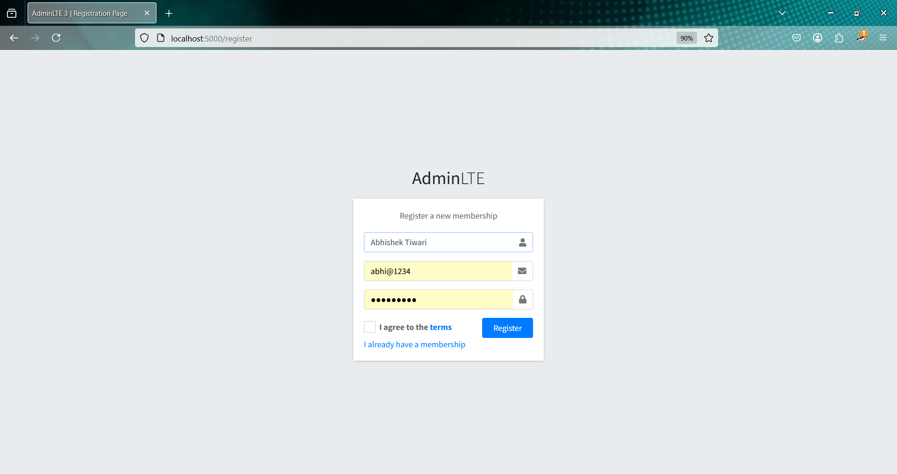

# 🧑‍💼 User Info Management System

A full-featured user management system built with **Node.js**, **Express**, **MongoDB**, **EJS**, and **AdminLTE 3**. It includes authentication, file uploads, CRUD operations, pagination, and a responsive admin dashboard.

---

## 🚀 Features

- 🔐 User authentication (register/login/logout)
- 📝 Create, Read, Update, and Delete (CRUD) user profiles
- 📁 Profile picture upload using **Multer**
- 🔒 Password hashing with **bcrypt**
- 📊 Responsive admin dashboard with **AdminLTE 3**
- 📃 Server-side pagination for large datasets
- 📁 File uploads stored locally

---

## 🛠️ Tech Stack

- **Backend**: Node.js, Express
- **Frontend**: EJS, AdminLTE 3
- **Database**: MongoDB with Mongoose
- **Security**: bcrypt for password hashing
- **File Uploads**: Multer

---

## 📁 Project Structure


<pre>
UserInfoManagement/
├── assets/                 # Media assets (images, videos for documentation/screenshots)
│   ├── login.mp4           # Login page background video
│   ├── userdashboard.png   # Screenshot of user dashboard
│   ├── adduser.png         # Screenshot of add user form
│   ├── edituser.png        # Screenshot of edit user form
│   └── deleteuser.png      # Screenshot of delete user confirmation
├── database/               # MongoDB connection logic
│   └── db.js               # Database configuration
├── models/                 # Mongoose schema definitions
│   └── usermodel.js        # User schema
├── node_modules/           # Node.js dependencies (auto-generated)
├── public/                 # Static assets (CSS, JS, etc.)
│   ├── css/
│   │   └── styles.css      # Main stylesheet
│   └── js/
│       └── script.js       # Custom JavaScript (if any)
├── routes/                 # Route definitions
│   └── route.js            # Main routing logic
├── uploads/                # Uploaded profile images
│   └── (user images)       # User-uploaded profile pictures
├── views/                  # EJS templates for rendering the frontend
│   ├── layout/             # Layout files (header/footer)
│   │   ├── header.ejs      # Header partial
│   │   └── footer.ejs      # Footer partial
│   ├── datatable.ejs       # User data table view
│   ├── edituser.ejs        # Edit user form view
│   ├── home.ejs            # Dashboard/homepage view
│   ├── login.ejs           # Login page view
│   ├── register.ejs        # Registration page view
│   └── userdata.ejs        # Detailed user info view
├── .env                    # Environment variables file
├── .gitignore              # Git ignore rules
├── app.js                  # Main Express server file
├── package-lock.json       # Lock file for npm dependencies
├── package.json            # Project metadata and dependencies
└── README.md               # Project documentation
</pre>


---

## 🔧 Installation

1. **Clone the repository**:
   ```bash
   git clone https://github.com/YOUR_USERNAME/YOUR_REPO_NAME.git
   cd YOUR_REPO_NAME

Install dependencies:

2. npm install
 
3. Setup environment variables: Create a .env file in the root directory with the following content:

PORT=5000
MONGODB_URI=mongodb://localhost:27017/user-info-system
SESSION_SECRET=your_secret_key

4. Start the application:

npm start

5. Visit the app in your browser:

http://localhost:5000

---


## 📸 Preview


### 🔐 Login Page


---

### 📝 Register Page



---

### 🏠 User Dashboard


---

### ➕ Add User Form


---

### ✏️ Edit User Form


---

### 🗑️ Delete User Confirmation


---

🤝 Contributing
Contributions are welcome!
Fork the repo, create a feature branch, and open a pull request.

📜 License
Licensed under the MIT License.

👨‍💻 Author
Abhishek Tiwari
🔗 GitHub