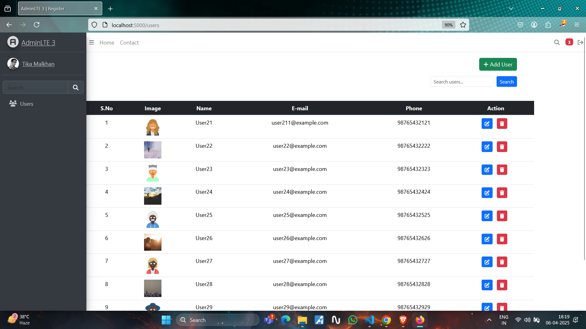
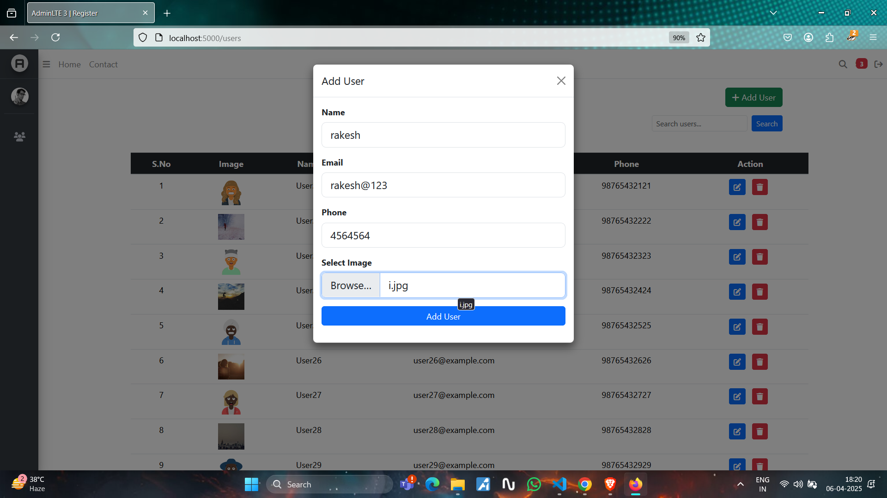
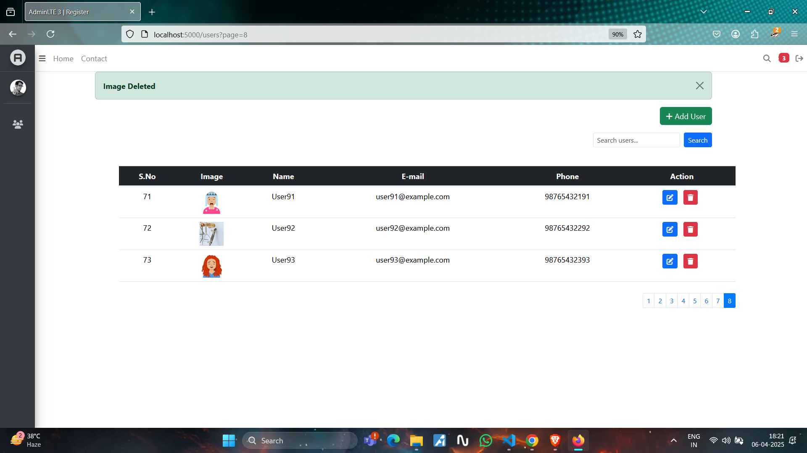

# 🧑‍💼 User Info Management System

A full-featured user management system built with **Node.js**, **Express**, **MongoDB**, **EJS**, and **AdminLTE 3**. It includes authentication, file uploads, CRUD operations, pagination, and a responsive admin dashboard.

---

## 🚀 Features

- 🔐 User authentication (register/login/logout)
- 📝 Create, Read, Update, and Delete (CRUD) user profiles
- 📁 Profile picture upload using **Multer**
- 🔒 Password hashing with **bcrypt**
- 📊 Responsive admin dashboard with **AdminLTE 3**
- 📃 Server-side pagination for large datasets
- 📁 File uploads stored locally

---

## 🛠️ Tech Stack

- **Backend**: Node.js, Express
- **Frontend**: EJS, AdminLTE 3
- **Database**: MongoDB with Mongoose
- **Security**: bcrypt for password hashing
- **File Uploads**: Multer

---

## 📁 Project Structure


UserInfoManagement/ ├── assets/ # Media assets (images, videos for documentation/screenshots) │ ├── login.mp4 # Login page background video │ ├── userdashboard.png # Screenshot of user dashboard │ ├── adduser.png # Screenshot of add user form │ ├── edituser.png # Screenshot of edit user form │ └── deleteuser.png # Screenshot of delete user confirmation ├── database/ # MongoDB connection logic │ └── db.js ├── models/ # Mongoose schema for users │ └── usermodel.js ├── public/ # Static assets (CSS, JS, etc.) ├── routes/ # Route definitions │ └── route.js ├── uploads/ # Uploaded profile images │ └── (Uploaded profile images) ├── views/ # EJS templates for rendering pages │ ├── layout/ # Layout files (header/footer) │ ├── datatable.ejs # User data in table format │ ├── edituser.ejs # Edit user form │ ├── home.ejs # Home dashboard │ ├── login.ejs # Login page │ ├── register.ejs # Registration page │ └── userdata.ejs # Detailed user info view ├── .env # Environment variables ├── .gitignore # Git ignore rules ├── app.js # Main server file ├── package.json # Project dependencies and scripts └── README.md # Project documentation


---

## 🔧 Installation

1. **Clone the repository**:
   ```bash
   git clone https://github.com/YOUR_USERNAME/YOUR_REPO_NAME.git
   cd YOUR_REPO_NAME

Install dependencies:

2. npm install
 
3. Setup environment variables: Create a .env file in the root directory with the following content:

PORT=5000
MONGODB_URI=mongodb://localhost:27017/user-info-system
SESSION_SECRET=your_secret_key

4. Start the application:

npm start

5. Visit the app in your browser:

http://localhost:5000

---


## 📸 Preview


### 🔐 Login Page


> *(You may not be able to preview videos directly in GitHub README, but it will be available as a downloadable asset.)*

---

### 🏠 User Dashboard


---

### ➕ Add User Form


---

### ✏️ Edit User Form


---

### 🗑️ Delete User Confirmation



---

🤝 Contributing
Contributions are welcome!
Fork the repo, create a feature branch, and open a pull request.

📜 License
Licensed under the MIT License.

👨‍💻 Author
Abhishek Tiwari
🔗 GitHub